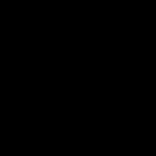
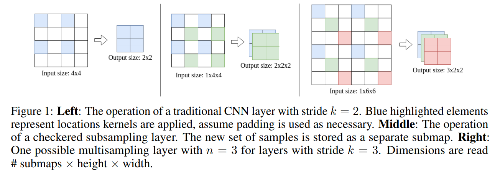
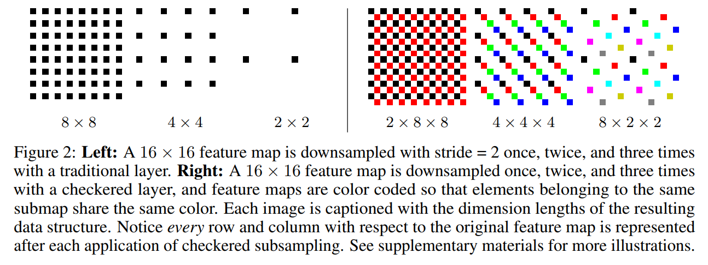

Checkered Convolutional Neural Networks and Multisampling
=======================================================

<center>

Traditional subsampling layers          |  Checkered subsampling layers
:-------------------------:|:-------------------------:
  |  

</center>

**Paper**: [[1805.10766] Improving the Resolution of CNN Feature Maps Efficiently with Multisampling](https://arxiv.org/abs/1805.10766)  
**Authors**: [Shayan Sadigh](https://shayanpersonal.github.io/), [Pradeep Sen](https://web.ece.ucsb.edu/~psen/)  
**Slides**: https://github.com/ShayanPersonal/checkered-cnn/blob/master/media/checkered_cnn_slides.pdf

**tldr:** Our subsampling layers generate much denser feature maps compared to traditional strided layers and significantly improve the performance of CNNs in image classification.

We present a new technique for increasing the receptive field of CNNs, checkered subsampling. Checkered subsampling layers generate drastically more informative feature maps than traditional subsampling layers and significantly improve the accuracy of modern CNNs in our experiments. Unlike **dilation**, another popular technique used to increase receptive field, checkered subsampling performs *subsampling* and reduces the complexity of deep layers. Checkered subsampling is part of a wider range of techniques we call **multisampling**. 

Multisampling is a generalization of current methods that allows you to control how much resolution you lose at each subsampling layer of your network. Traditional subsampling layers and dilated layers can be viewed as opposite, extreme cases of multisampling. A traditional subsampling layer with stride=k is equivalent to a multisampling layer that uses a k by k sampler that chooses only one element of each sampling window, the top-left corner, to sample. Increasing dilation by k times is equivalent to multisampling with a k by k sampler and choosing to sample *every* element.

This repository contains:
- Implementations of checkered layers and a conversion script for converting traditional CNNs into checkered CNNs (CCNNs) in **checkered_layers.py**. 
- A script for visualizing the patterns created by checkered subsampling in **visualizer.py**. 
- Scripts for training our toy CCNN on MNIST (**demo_mnist.py**) and modern models on CIFAR (**demo_cifar.py**).
- The implementations of DenseNet, ResNet, and VGG that we used in our paper under **models/**.
- Our implementation of tiny ResNet under models/ and our toy CCNN defined in demo_mnist.py.

Checkered subsampling improves the accuracy of every architecture we test on CIFAR10/CIFAR100 (VGG, DenseNet, Wide-ResNet, ResNet). Our tiny ResNet CCNNs achieve accuracy competitive with their full-sized CNN counterparts. Our toy CCNN model trained on MNIST with augmentations achieves accuracy competitive with capsule networks (8.2 million parameters) and beyond the baseline CNN used in the CapsNet paper (35.4 million parameters) with just 93,833 parameters. 

 

### Citation
If you find multisampling or checkered subsampling useful in your research, please consider citing:

    @ARTICLE{Sadigh2018,
        author = {Shayan Sadigh and Pradeep Sen},
        title = "{Improving the Resolution of CNN Feature Maps Efficiently with Multisampling}",
        journal = {ArXiv e-prints},
        archivePrefix = "arXiv",
        eprint = {1805.10766},
        year = 2018,
    }


## Requirements
- Python 3
- Pytorch 0.4
- Numpy
- Fire ('pip install fire' or 'conda install fire -c conda-forge')
- Pillow ('pip install pillow' or 'conda install pillow')

## How to run
After you have cloned the repository, you can either visualize checkered subsampling or train networks on MNIST and CIFAR.

To visualize a 64x64 image after 3 subsampling steps using the regularly spaced lattice method (output images can be found in the visualize_output/ folder):
```bash
python visualize.py --im_size 64 --steps 3 --method lattice
```
To train our tiny CCNN on MNIST (replace data_path with your own path to MNIST, will automatically be downloaded if you don't have it):
```bash
python demo_mnist.py --data_path ../data/mnist
```
To train ResNet50 as a CNN on CIFAR100 (replace data_path with your own path to CIFAR, will automatically be downloaded if you don't have it):
```bash
python demo_cifar.py --data_path ../data/cifar
```

To train ResNet50 as a CCNN on CIFAR100:
```bash
python demo_cifar.py --data_path ../data/cifar --convert
```

If you want to customize stuff see each file for more information and arguments.


## IMPORTANT
If you apply "convert_to_checkered" on your own CNN, you must also modify the forward pass of your network to add a submap dimension to the input before any processing by CNN layers. This can be done by using torch's unsqueeze method to add a new dimension. The dimension must be added to where 3D layers expect the "depth" dimension to be.  Also, if you use methods from torch.nn.functional, you may have to replace them with their 3D versions or take the mean across the submap dimension before applying them. The conversion script cannot replace these function calls for you.

For example, if your forward pass looks like this:
```python
def forward(self, x):
    x = self.layer1(x)
    x = self.layer2(x)
    x = self.layer3(x)
    x = self.layer4(x)
    x = F.avg_pool2d(x, 7).view(x.size(0), -1)
    x = self.fc(x)
    return x
```
Modify it to look like this:
```python
def forward(self, x):
    x = x.unsqueeze(2)
    x = self.layer1(x)
    x = self.layer2(x)
    x = self.layer3(x)
    x = self.layer4(x)
    x = torch.mean(x, 2)
    x = F.avg_pool2d(x, 7).view(x.size(0), -1)
    x = self.fc(x)
    return x
```

Also, if you're using a really custom architecture, the conversion script may not be able to handle it. We've only tested it on popular designs such as DenseNet, ResNet, VGG, and SqueezeNet. If you have a unique design that the conversion script doesn't handle, then you need to do one of two things:

- Go through your architecture's code and replace each 2D layer with a checkered layer by hand (**see CheckeredCNN in demo_mnist.py for an example of how to build a checkered CNN from scratch**).
- Add support for the layers in your architecture to the conversion script (start at the convert_to_checkered method underneath checkered_layers.py). Use the already-provided code as an example for what you need to add in.


## Currently supported Layers
Our conversion script converts the following 2D layers to checkered or 3D layers:
- Conv2d -> CheckeredConv2d
- BatchNorm2d -> BatchNorm3d
- Dropout2d -> Dropout3d
- AdaptiveMaxPool2d -> AdaptiveMaxPool3d
- AdaptiveAvgPool2d -> AdaptiveAvgPool3d
- MaxPool2d -> MaxPool3d
- AvgPool2d -> AvgPool3d

If you're using an architecture with other types of layers you need to add in support for those layers yourself for now. Use the code in checkered_layers.py as a guide for how to do that.

## How do I build my own checkered CNN from scratch?
Just build a CNN as normal as you normally would in Pytorch, except instead of using Conv2d layers use CheckeredConv2d layers, and all other 2D layers should be replaced with 3D versions (Dropout3D, BatchNorm3d...). Also, use x = x.unsqueeze(2) to add a submap dimension to your input at the start of your network. Since layers are all 3D, the input needs to be 5D (batch_size, channels, submaps (or "depth"), height, width). The starting number of submaps should be 1. In order to perform subsampling, set stride=2 in a CheckeredConv2d layer. The feature maps will have their height and width reduced by 2 times, and the submap count will increase by 2 times.
